# 🧼 Soap Maker App

A Flutter + Firebase mobile application for hobbyists and professionals to create, manage, and track their soap making recipes and inventory.

---
## Screens

<div style="display: flex; flex-wrap: wrap; gap: 10px; justify-content: center;">
  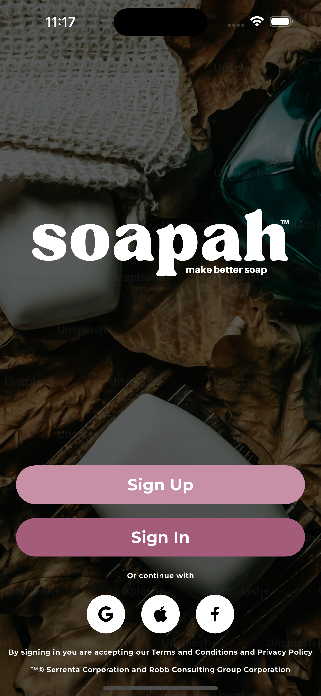
  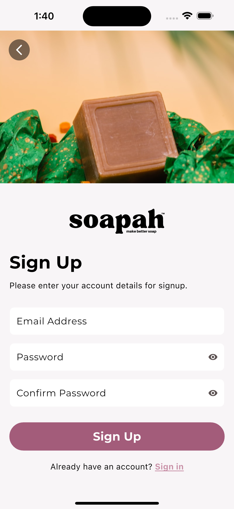
  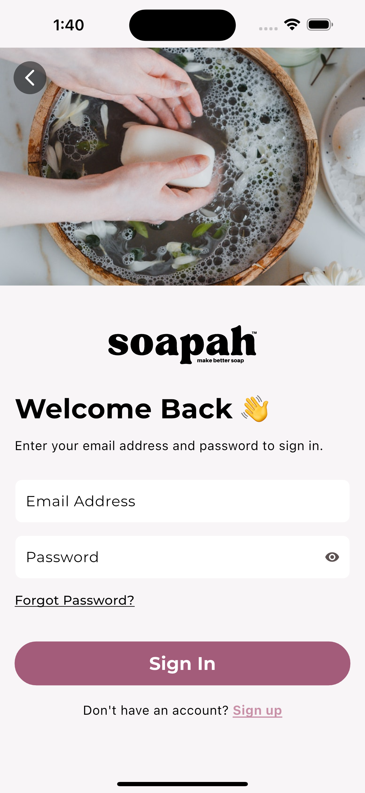
  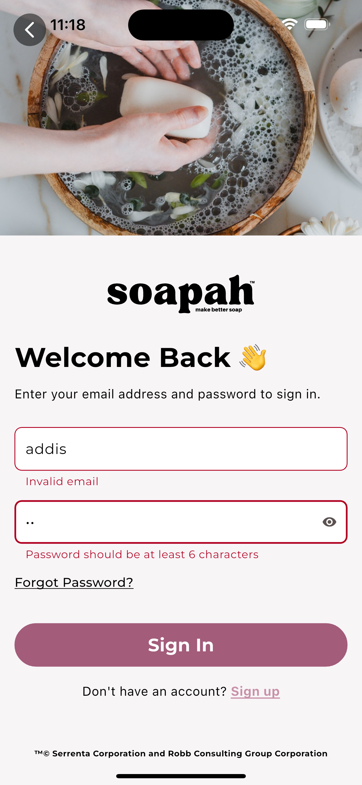
  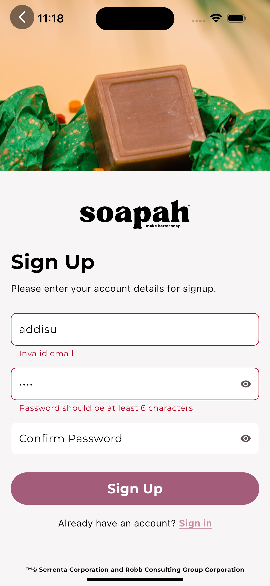
  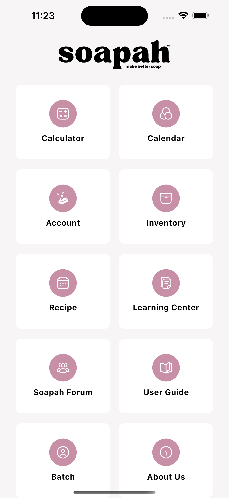
  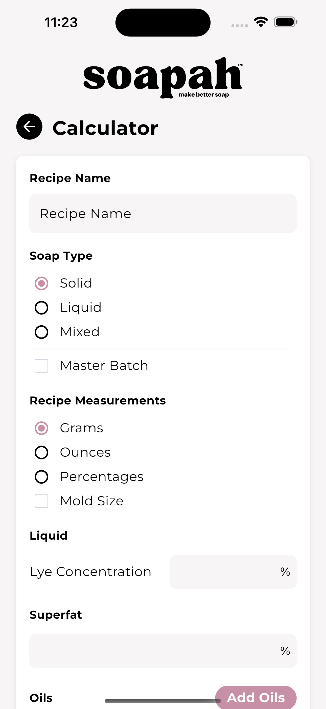
  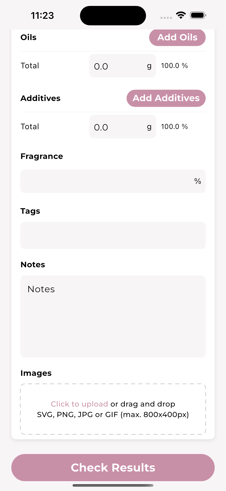
  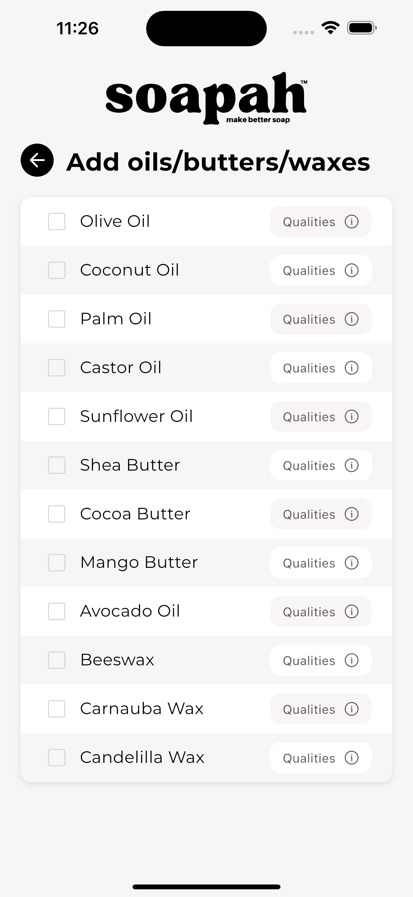
  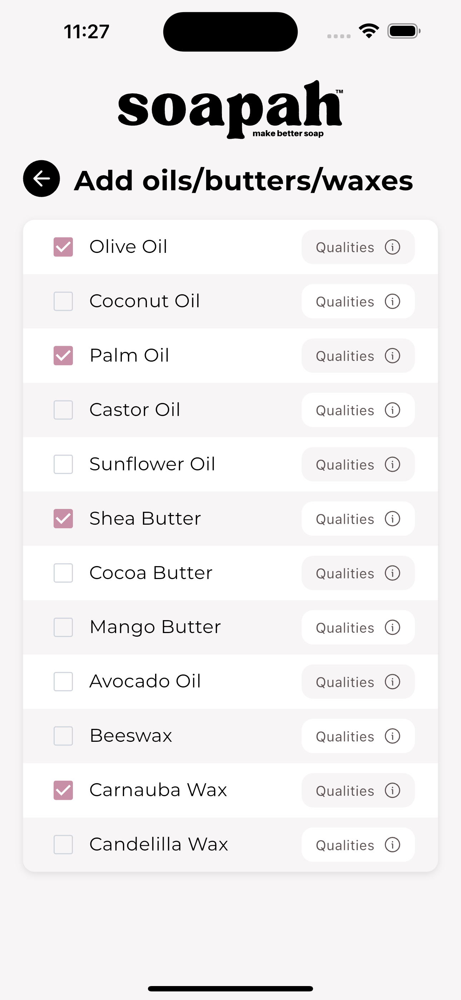
  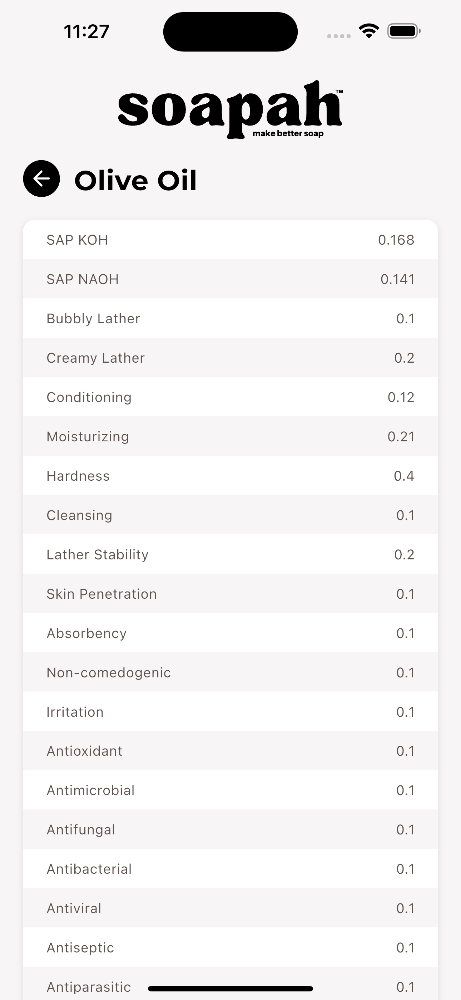
  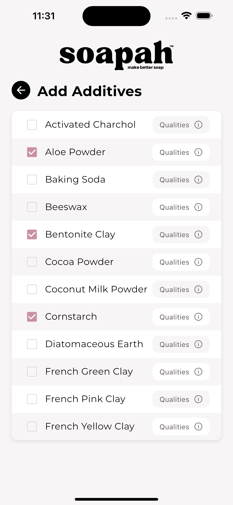
  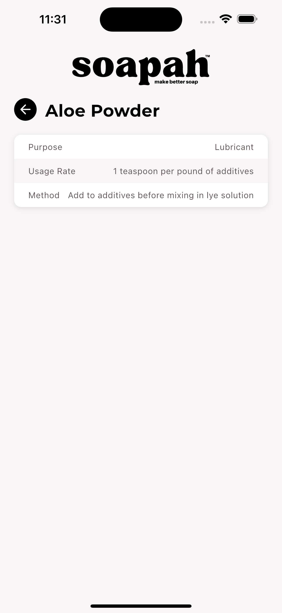
  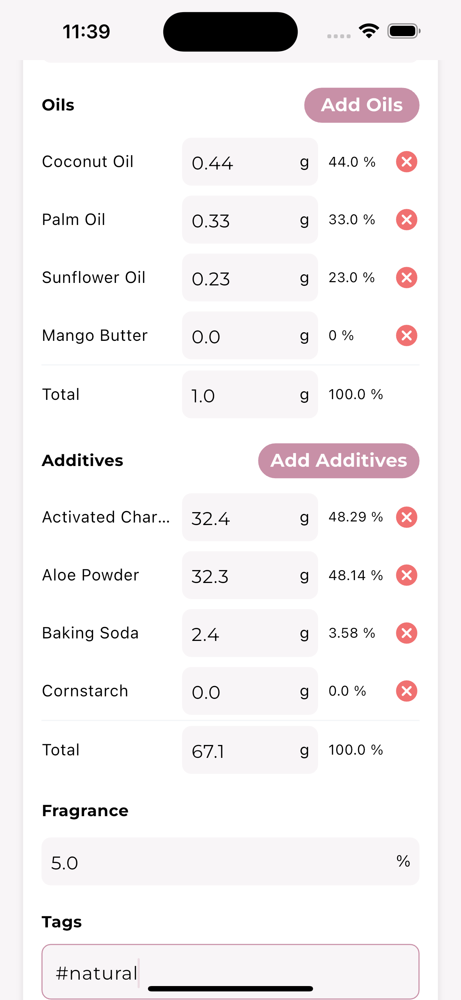
  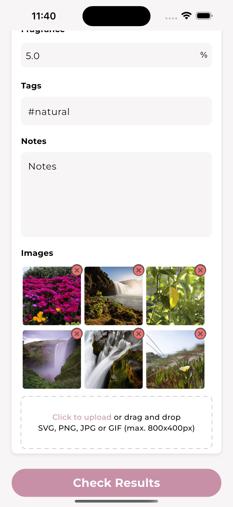
  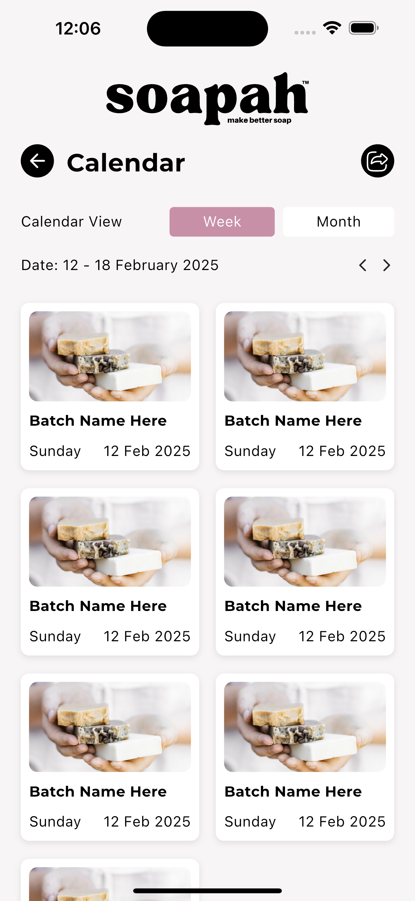
  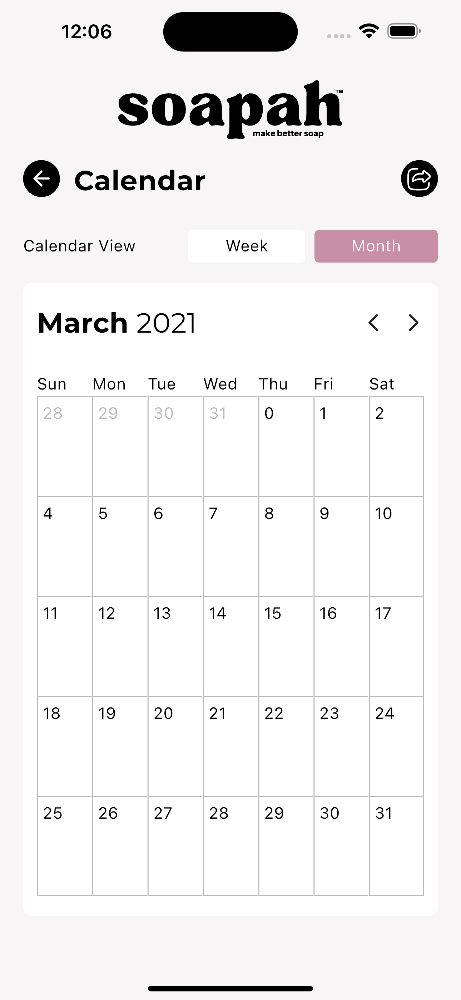
  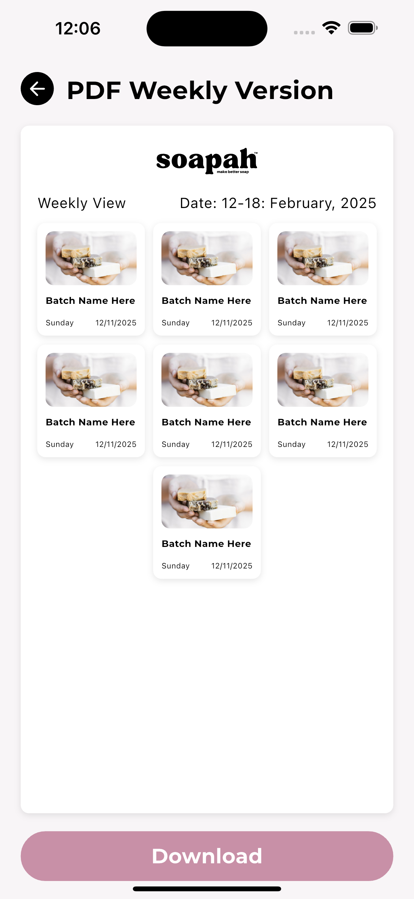
  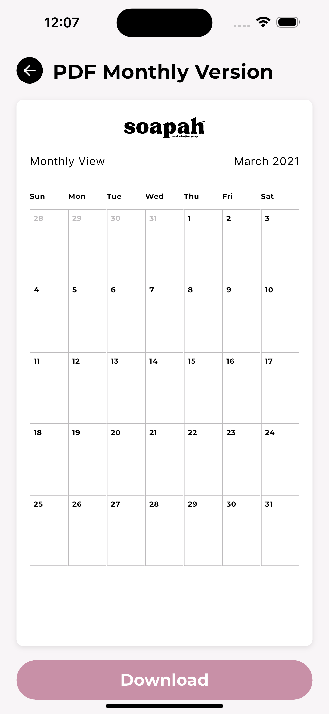
  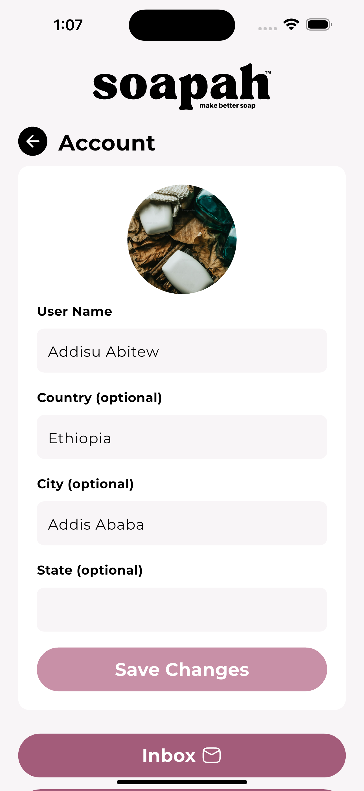
  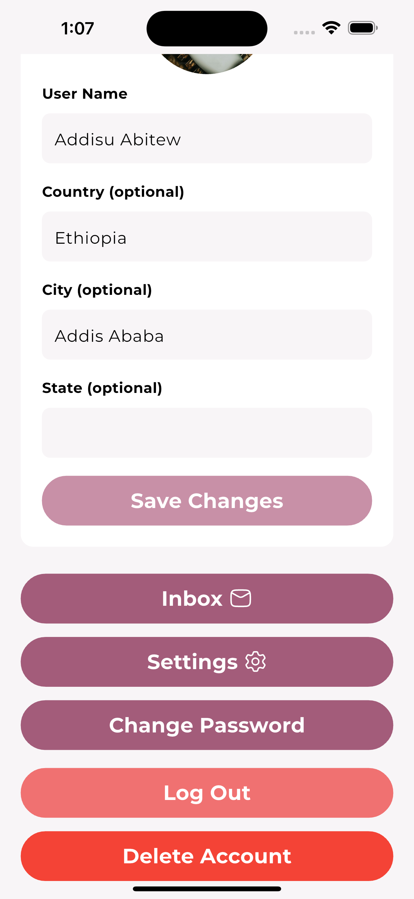
  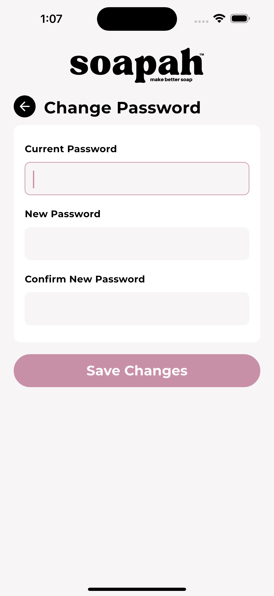
</div>

## 📲 Features

### 🧪 Soap Recipe Calculator
- Create custom soap recipes using oils, additives, and superfat percentage
- Calculates precise lye and water ratios based on SAP values

### 📖 Recipe Builder
- Save and edit recipes
- Add notes, ingredients, and process instructions

### 📆 Production Calendar
- Schedule soap batches and track curing times
- Set reminders for important dates

### 📋 Batch Logging
- Record and review past batches
- Maintain consistency and quality control

### 📦 Inventory Management
- Track available oils, additives, and materials
- Get notified when stocks run low

### 🔐 Authentication
- Secure login with Firebase Email/Password Auth
- (Optional) Google Sign-In

### 📚 Learning Center
- Access tutorials and articles on soap making
- Bookmark and read offline

---

## 🚀 Getting Started

### Prerequisites
- [Flutter](https://flutter.dev/docs/get-started/install) installed
- [Firebase CLI](https://firebase.google.com/docs/cli) installed
- Android Studio or Xcode for running on devices

### Setup Instructions

1. **Clone the repository:**

```bash
git clone https://github.com/addisu-abitew/soap-maker-app.git
cd soap-maker-app
```

2. **Install dependencies:**

```bash
flutter pub get
```

3. **Set up Firebase:**
  - Create a project on Firebase Console
  - Add Android and iOS apps
  - Download google-services.json (Android) and GoogleService-Info.plist (iOS)
  - Place them in the appropriate directories:

        android/app/google-services.json
        ios/Runner/GoogleService-Info.plist

4. **Run Firebase configuration:**

```bash
flutterfire configure
```

5. **Run the app:**

```bash
flutter run
```

### Project Structure
```bash
lib/
├── models/             # Data models (Recipe, Batch, Inventory)
├── services/           # Firebase services and utilities
├── providers/          # State management with Provider
├── pages/                        # Main app screens and their subcomponents
├── router/                       # App routing and navigation configuration
├── theme/                        # App-wide styling, colors, and text themes
├── utils/                        # Helper functions, constants, formatters, and extensions
└── widgets/                      # Reusable UI widgets shared across multiple pages
```


### 🧪 Tech Stack
  - Frontend: Flutter (Dart)
  - Backend: Firebase
    - Firestore (Database)
    - Firebase Auth (Authentication)
    - Firebase Storage (Images & files)
    - Firebase Cloud Messaging (Push notifications)
  - Local Storage: Hive

### 🙌 Contributing
Pull requests are welcome. For major changes, please open an issue first to discuss what you would like to change.